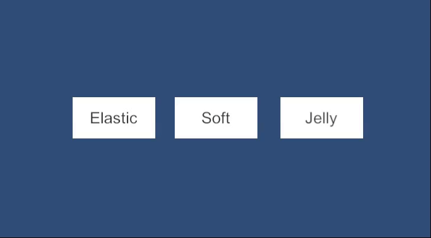

# Animalo - A Simple Way to Animate UI

Animalo is a lightweight and easy-to-use Unity UI animation system that provides a simple way to create smooth, professional animations for your user interface elements. Built on top of DOTween, Animalo offers a modular approach to animating panels, buttons, and UI elements with minimal setup.

## Summary

Animalo consists of four main components that work together to provide a complete UI animation solution:

- **PanelScript**: Manages panel visibility with smooth fade animations
- **Panel_Item**: Handles UI navigation stack and panel hierarchy
- **AutoAnim (Animalo)**: Creates sequenced animations for multiple UI elements
- **ButtonScaleTween**: Provides interactive button press animations

The system is designed to be intuitive, flexible, and performant, making it easy to add polished animations to any Unity UI project.

## Table of Contents

- [PanelScript](#panelscript)
- [Panel_Item](#panel_item)
- [AutoAnim](#autoanim)
- [ButtonScaleTween](#buttonscaletween)
- [Dependencies](#dependencies)

---

## PanelScript

`PanelScript` is a component that manages the visibility and animation of UI panels using `CanvasGroup` and DOTween. It provides smooth fade-in and fade-out transitions when showing or hiding panels.

### Features

- **Fade Animations**: Smooth alpha transitions when enabling/disabling panels
- **Customizable Timing**: Configurable exit time and animation duration
- **Unscaled Time Support**: Option to use unscaled time for animations (useful when game is paused)
- **Animator Integration**: Optional Unity Animator support for custom animations
- **Event System**: `onEnableEvent` and `onDisableEvent` callbacks for custom logic

### Usage

1. Add `PanelScript` component to your panel GameObject (requires `CanvasGroup`)
2. Configure the following properties:
   - `exitTime`: Duration of the fade animation
   - `startFad`: Enable fade-in when panel becomes active
   - `endFad`: Enable fade-out when panel becomes inactive
   - `disableImmediately`: Skip animation and disable immediately
   - `unscaledTime`: Use unscaled time for animations

3. Control panel visibility using:
   ```csharp
   panelScript.SetActive(true);  // Show with fade-in
   panelScript.SetActive(false); // Hide with fade-out
   ```


---

## Panel_Item

`Panel_Item` extends `PanelScript` functionality by implementing a navigation stack system. It manages the hierarchy of UI panels, allowing you to navigate between different screens with proper back button functionality.

### Panel Types

- **NormalPanel**: Standard panel that pushes onto the navigation stack
- **Popup**: Overlay panel that doesn't affect the navigation stack
- **MainPanel**: Root panel that initializes the navigation system
- **StaticMenu**: Persistent menu that remains visible across panel changes

### Features

- **Navigation Stack**: Automatic management of panel hierarchy using a Stack
- **Back Navigation**: Built-in `Back()` method to return to previous panel
- **Static Menu Control**: Automatically show/hide static menus based on current panel
- **Event Integration**: UnityEvent support for custom back button behavior

### Usage

1. Add `Panel_Item` component to your panel (requires `PanelScript`)
2. Set the `uiPanelItemType` to match your panel's purpose
3. For navigation:
   ```csharp
   // Open a new panel
   panel1.SetActive(treu); 
   panel2.SetActive(true); // panel 1 will be disable and panel 2 enable
   
   // Go back
   Panel_Item.Back(); // panel 2 will be disable and pannel 1 enable
   ```


---

## AutoAnim

`AutoAnim` (class name: `Animalo`) is a powerful system for creating sequenced animations on multiple UI elements. It allows you to define a list of UI elements with their respective animations, delays, and animation types, creating complex, choreographed UI reveals.

### Features

- **Sequenced Animations**: Animate multiple elements with staggered delays
- **Multiple Animation Types**: Support for various animation actions (Fade, Pop, Slide, etc.)
- **Separate In/Out Animations**: Different animations for showing and hiding
- **Base State Caching**: Automatically caches original positions, scales, and rotations
- **Reset Functionality**: Reset all elements to their base state instantly
- **Editor Integration**: Odin Inspector buttons for testing animations in the editor

### Available Animation Actions

- **UIAnim_Fade**: Fade in/out animation
- **UIAnim_Pop**: Scale-based pop animation with overshoot
- **UIAnim_SlideFromBottom**: Slide from bottom of screen
- **UIAnim_SlideFromOffset**: Slide from custom offset position
- **UIAnim_SlideToOffset**: Slide to custom offset position
- **UIAnim_StretchSlideIn**: Stretch and slide animation
- **UIAnim_AxialOrbitalIn**: Orbital rotation animation

### Usage

1. Add `Animalo` component to your panel or container
2. In the Inspector, add items to the `items` array:
   - Assign the `target` RectTransform
   - Set `delay` for when the animation should start
   - Assign an `action` (ScriptableObject animation type)
   - Optionally assign `outAction` for hide animation

3. Configure settings:
   - `playOnEnable`: Automatically play on enable
   - `resetBeforePlay`: Reset to base state before playing
   - `defaultDelay`: Default delay between items
   - `baseDelay`: Base delay added to all items

4. Control animations:
   ```csharp
   animalo.Show();  // Play show animations
   animalo.Hide();  // Play hide animations
   ```


### Creating Custom Animations

To create a custom animation action:

1. Create a new ScriptableObject inheriting from `UIAnimAction`
2. Implement the `Build()` method to return a DOTween Sequence
3. Use `CreateAssetMenu` attribute for easy creation in Unity

```csharp
[CreateAssetMenu(menuName = "UI Anim/Custom")]
public class UIAnim_Custom : UIAnimAction
{
    public override Sequence Build(RectTransform target, Vector2 basePos, 
        Vector3 baseScale, float baseRotZ, float delay)
    {
        var seq = DOTween.Sequence();
        seq.AppendInterval(delay);
        // Your animation logic here
        return seq;
    }
}
```

---

## ButtonScaleTween

`ButtonScaleTween` provides interactive button press animations that respond to user input. It scales buttons down when pressed and animates them back to original size when released, creating a tactile feedback effect.



### Features

- **Pointer Event Integration**: Automatically responds to `IPointerDown` and `IPointerUp` events
- **Customizable Profiles**: Use ScriptableObject profiles for different animation styles
- **Default Behavior**: Works out-of-the-box with a soft scale animation
- **Profile System**: Create and assign custom animation profiles (Elastic, Jelly, Soft)
- **Transform Caching**: Automatically caches original scale and rotation

### Built-in Profiles

- **SoftButtonAnimProfile**: Gentle scale animation
- **ElasticButtonAnimProfile**: Bouncy elastic animation
- **JellyTiltButtonAnimProfile**: Jelly-like effect with rotation

### Usage

1. Add `ButtonScaleTween` component to your button GameObject
2. Optionally assign a custom `ButtonAnimProfile` in the Inspector
3. If no profile is assigned, it uses the default soft animation
4. The component automatically handles pointer events


### Creating Custom Button Profiles

1. Create a ScriptableObject inheriting from `ButtonAnimProfileBase`
2. Implement `OnDown()` and `OnUp()` methods
3. Use `CreateAssetMenu` attribute

```csharp
[CreateAssetMenu(menuName = "UI/Button Anim/Custom")]
public class CustomButtonProfile : ButtonAnimProfileBase
{
    public override void OnDown(Transform target, Vector3 originalScale, Quaternion originalRotation)
    {
        target.DOKill();
        target.DOScale(originalScale * 0.85f, 0.1f);
    }

    public override void OnUp(Transform target, Vector3 originalScale, Quaternion originalRotation)
    {
        target.DOKill();
        target.DOScale(originalScale, 0.3f).SetEase(Ease.OutBounce);
    }
}
```

---

## Dependencies

Animalo requires the following dependencies to function properly:

### Required

- **DOTween** 
  - Used for all tweening operations
  - Available on the Unity Asset Store
  - Version: Latest stable version

### Optional (Recommended)

- **Odin Inspector** (Sirenix)
  - Provides enhanced Inspector features
  - Used for editor buttons and better UI in Inspector
  - Available on the Unity Asset Store
  - Not required for runtime functionality


### Package Dependencies

The project uses the following Unity packages (from `manifest.json`):
- `com.unity.ugui` - Unity UI system
- `com.unity.inputsystem` - New Input System
- `com.unity.timeline` - Timeline for sequencing
- Other standard Unity modules

---

## Getting Started

1. **Setup a Panel**:
   - Create a GameObject with CanvasGroup
   - Add `PanelScript` component
   - Configure fade settings

2. **Add Navigation**:
   - Add `Panel_Item` component
   - Set panel type (MainPanel, NormalPanel, etc.)

3. **Animate Elements**:
   - Add `Animalo` component
   - Create animation action assets (UIAnim_Fade, UIAnim_Pop, etc.)
   - Assign targets and configure delays

4. **Animate Buttons**:
   - Add `ButtonScaleTween` to button GameObjects
   - Optionally create and assign button animation profiles

## License

This project is provided as-is for use in Unity projects.

## Support

For issues, questions, or contributions, please refer to the project repository.

